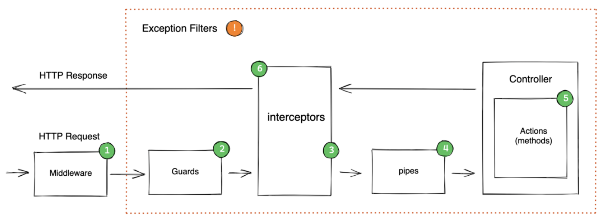

# Nestjs Safety Event Emitter

## NestJS Request LifeCycle



- `src/safety-event-emitter/safety-event-decorators.ts`

```ts
export const OnSafetyEvent = (event: string) =>
  applyDecorators(OnEvent(event), (_target: any, _key: string, descriptor: PropertyDescriptor) => {
    const handler = descriptor.value;
    const metadataKeys = Reflect.getOwnMetadataKeys(descriptor.value);
    const metadataValues = metadataKeys.map((key) => {
      return [key, Reflect.getMetadata(key, descriptor.value)];
    });

    /** @here blocking handler with await */
    descriptor.value = async function (...args: any[]) {
      try {
        return await handler.bind(this)(...args);
      } catch (e) {
        return e;
      }
    };

    metadataValues.forEach(([key, value]) => Reflect.defineMetadata(key, value, descriptor.value));
  });
```

- `src/safety-event-emitter/safety-event.emitter.ts`

```ts
@Injectable()
export class SafetyEventEmitter {
  constructor(private readonly eventEmitter: EventEmitter2) {}
  async emitAsync(event: string | symbol | event[], ...values: any[]): Promise<any> {
    const errorOrValues = await this.eventEmitter.emitAsync(event, ...values);

    /** @here catch error or exception */
    for (const errorOrValue of errorOrValues) {
      if (errorOrValue instanceof Error) {
        throw errorOrValue;
      }
    }

    return errorOrValues;
  }
}
```

- `test/app.e2e-spec.ts`

```ts
let app: INestApplication;

beforeAll(async () => {
  const moduleFixture: TestingModule = await Test.createTestingModule({
    imports: [AppModule],
  }).compile();

  app = moduleFixture.createNestApplication();
  app.useGlobalFilters(new AppGlobalExceptionFilter());

  await app.init();
});
```

```ts
describe('nestjs event emitter', () => {
  it('(GET) /nestjs/ok - should be 200', () => {
    return request(app.getHttpServer()).get('/nestjs/ok').expect(200).expect(['ok']);
  });

  it('(GET) /nestjs/error - should be 200', () => {
    return request(app.getHttpServer()).get('/nestjs/error').expect(200).expect([null]);
  });

  it('(GET) /nestjs/exception - should be 200', () => {
    return request(app.getHttpServer()).get('/nestjs/exception').expect(200).expect([null]);
  });
});
```

```ts
describe('safery event emitter', () => {
  it('(GET) /safety/ok - should be 200', () => {
    return request(app.getHttpServer()).get('/safety/ok').expect(200).expect(['ok']);
  });

  it('(GET) /safety/error - should be 500', () => {
    return request(app.getHttpServer())
      .get('/safety/error')
      .expect(500)
      .expect(new InternalServerErrorException(SafetyEventSubject.Error).getResponse());
  });

  it('(GET) /safety/exception - should be 400', () => {
    return request(app.getHttpServer())
      .get('/safety/exception')
      .expect(400)
      .expect(new BadRequestException(SafetyEventSubject.Exception).getResponse());
  });
});
```
